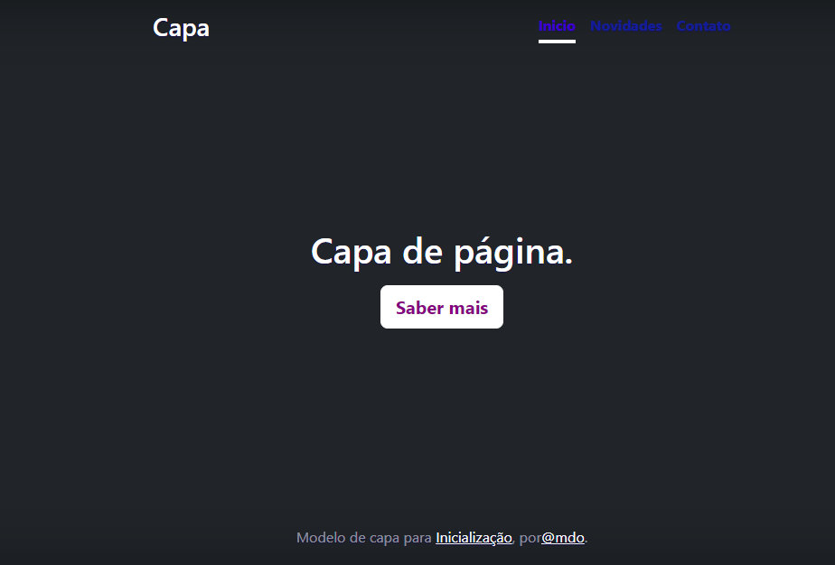

# Índice

[Progeto - Apredendo a escrever um README](#progeto---apredendo-a-escrever-um-readme)  
[Descrição ](#descri%C3%A7%C3%A3o)  
[Introdução](#introdu%C3%A7%C3%A3o)  
[Funcionaldades](#funcionaldades)  
[Tecnologias utilizadas](#tecnologias-utilizadas)  
[Fontes consultadas](#fontes-consultadas)  
[Autores](#autores)  

# Progeto - Apredendo a escrever um README
 

## Descrição 
É uma pagina inicial que com botões de novidades, contatos e saber mias
## Introdução 
Este projeto é uma página de capa  usando Bootstrap v5.0,  ideal para página inicial, com cabeçalho, seção  principal e rodapé
## Funcionaldades

`Cabeçalho`: três botões para navegações
* Inicio para retornar ao inicio da página
* Novidades para ver atualizções do site
* contato para entrar em contato com um grupo de atentimento

`saber mais`:
* botão que é direcionado a outra página com mais informações

 `rodapé`: Dois links
 * o primeiro  direciona para a página oficial do bootstrap
 * o segundo para a conta do X do idealizar da página

### Tecnologias utilizadas
* HTML 5.0
* CSS 3.0
* Bootstrap v5.0
* Github
* VsCode
## Fontes consultadas

* [Alura](https://www.alura.com.br/artigos/escrever-bom-readme) - Como escrever um README incrível 
* [GitREADME](https://gist.github.com/lohhans/f8da0b147550df3f96914d3797e9fb89) - 
Consulta com o Professor Leonardo Rocha
## Autores
* [Gabriel](https://github.com/Braboalenda04)

* [Miguel](https://github.com/miguelitto16)

* [Nicolas](https://github.com/NicolasMussi89)