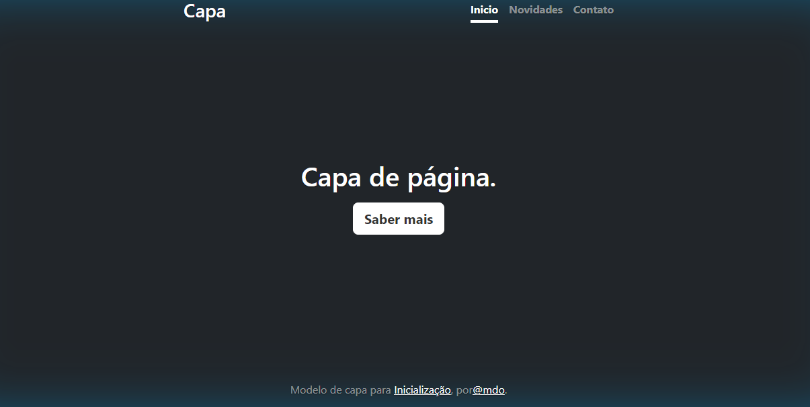

# Índice

[Progeto - Apredendo a escrever um README](#progeto---apredendo-a-escrever-um-readme)  
[Descrição ](#descri%C3%A7%C3%A3o)  
[Introdução](#introdu%C3%A7%C3%A3o)  
[Funcionaldades](#funcionaldades)  
[Tecnologias utilizadas](#tecnologias-utilizadas)  
[Fontes consultadas](#fontes-consultadas)  
[Autores](#autores)  

# Progeto - Apredendo a escrever um README
 

## Descrição 
É uma pagina inicial que com botões de novidades, contatos e saber mias
## Introdução 
Este projeto é uma página de capa  usando Bootstrap v5.0,  ideal para página inicial, com cabeçalho, seção  principal e rodapé
## Funcionaldades
* Cabeçalho com links de navegação
* Botão "Saber mais" na pagina principal.
* Estilização usando CSS.

* Layout do Bootstrap.) 
### Tecnologias utilizadas
* HTML 
* CSS
* Bootstrap v5.0
* Github
## Fontes consultadas

* [Alura](https://www.alura.com.br/artigos/escrever-bom-readme) - Como escrever um README incrível 

Consulta com o Professor Leonardo Rocha
## Autores
[Gabriel, Miguel e Nicolas]